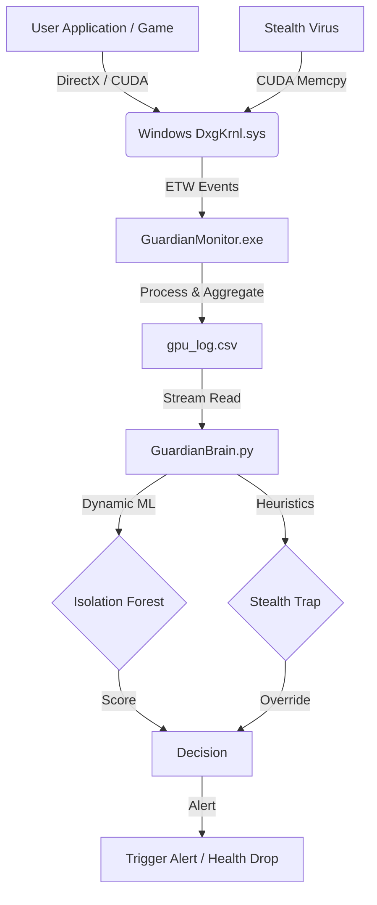

# Guardian GPU: Technical Architecture & Documentation

## 1. Executive Summary
**Guardian GPU** is a kernel-level Host Intrusion Detection System (HIDS) designed specifically for GPU workloads. Unlike traditional CPU antiviruses, Guardian monitors the GPU for unauthorized activities such as crypto-jacking, stealthy data exfiltration, and unauthorized compute workloads.

It employs a passive, agentless architecture using **Event Tracing for Windows (ETW)** to remain invisible to anti-cheat systems while maintaining granular visibility into every GPU packet.

---

## 2. System Architecture

The system is composed of two primary decoupled components:
1.  **Guardian Monitor (C++):** A lightweight kernel collector.
2.  **Guardian Brain (Python):** A real-time analysis engine using Machine Learning.



---

## 3. Component Details

### 3.1. The Guardian Monitor (Data Plane)
*   **Language:** C++ (MSVC)
*   **Core Technology:** Event Tracing for Windows (ETW)
*   **Target Provider:** `Microsoft-Windows-DxgKrnl` `{802ec45a-1e99-4b83-9920-87c98277ba9d}`
*   **Key Source Files:**
    *   `etw_monitor.cpp`: Initializes the trace session (`StartTraceA`) and consumes events via `OpenTraceA`.
    *   `EventRecordCallback`: The critical hot-path function.
        *   **Opcode 1 (Scanout/Start):** Records timestamp & increments Packet Count.
        *   **Opcode 2 (Complete/Stop):** Calculates `Duration = End_Time - Start_Time`.
*   **Output:** A Rolling CSV Log (`TIMESTAMP, PID, NAME, MEM, PWR, TIME_MS, COUNT, ...`).

### 3.2. The Guardian Brain (Control Plane)
*   **Language:** Python 3.x
*   **Core Libraries:** `scikit-learn` (IsolationForest), `pandas`.
*   **Key Logic:**
    1.  **Online Learning:** The model maintains a sliding window of the last **1000 Events**. It retrains every 50 events to adapt to changing baselines (e.g., launching a game).
    2.  **Heuristic Trap (The "Virus Catcher"):**
        *   *Vulnerability:* Pure ML might classify "Zero Compute" attacks as Idle.
        *   *Defense:* Any process with `PacketCount > 200` AND `ComputeTime < 1.0ms` is immediately flagged as `SUSPICIOUS_COPY`. This overrides the ML score.

---

## 4. Key Design Decisions

### 4.1. Why ETW instead of CUPTI (Injection)?
We initially explored code injection (`CUPTI`, `Detours`) but pivoted to Kernel Tracing for three reasons:
1.  **Safety & Stability:** Injecting DLLs into complex games (e.g., Cyberpunk 2077) often causes crashes. Passive listening is stable.
2.  **Anti-Cheat Compliance:** Games like *Valorant* (Vanguard) or *Call of Duty* (Ricochet) ban users for injecting foreign code. ETW is a native Windows feature and is whitelist-safe.
3.  **Evasion Resistance:** A sophisticated virus can detect a user-mode hook. However, to use the GPU, it *must* communicate with the Kernel (`DxgKrnl.sys`). It cannot hide from ETW.

### 4.2. Why Isolation Forest?
We lack a labeled dataset of "All Possible GPU Viruses". Isolation Forest is an unsupervised algorithm perfect for "Anomaly Detection"—it identifies data points that are "few and different" without needing to know *what* a virus looks like beforehand.

---

## 5. Detection Capabilities Matrix

| Threat Scenario | Metrics Signature | Detection Mechanism | Status |
| :--- | :--- | :--- | :--- |
| **Crypto Miner** | High Compute Time (>90%), Low/Medium Packets | **Isolation Forest** (Anomaly Score) | ✅ Detected |
| **Data Exfiltration** | Zero Compute Time, High Packet Count (DMA) | **Heuristic Trap** (Suspicious Copy) | ✅ Detected |
| **Gaming (Authorized)** | High Compute, High Packets | **Dynamic Learning** (Adapts Baseline) | ✅ Allowed |
| **Desktop Idle** | Low Compute, Low Packets | Base Model | ✅ Ignored |

---

## 6. Build & Deployment

### Prerequisites
*   Windows 10/11 SDK (for TDH/ETW libraries).
*   Visual Studio 2019+ (C++17 Standard).
*   Python 3.10+ (`pip install pandas scikit-learn numpy`).

### Compilation
```bash
# C++ Monitor
mkdir build && cd build
cmake ..
cmake --build . --config Release
```

### Execution
1.  **Monitor:** Run `GuardianMonitor.exe` as **Administrator** (Required for Kernel Access).
2.  **Brain:** Run `python guardian_brain.py` in a separate terminal.

---

## 7. Future Roadmap
*   **GPU VRAM Signature:** Analyze memory allocation patterns to detect "buffer stuffing".
*   **Network Correlation:** Re-enable the `TCPIP` provider to correlate GPU load with Outbound Traffic (C2 Servers).
*   **User UI:** Replace the terminal output with a React/Electron Dashboard.

---
*Generated by the Guardian Development Team*
