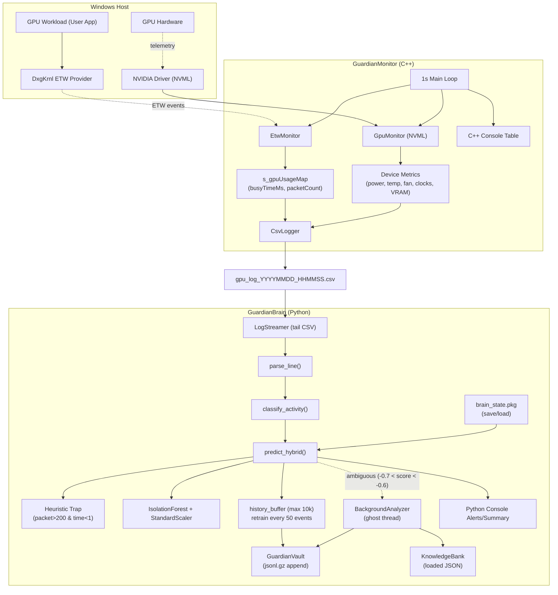
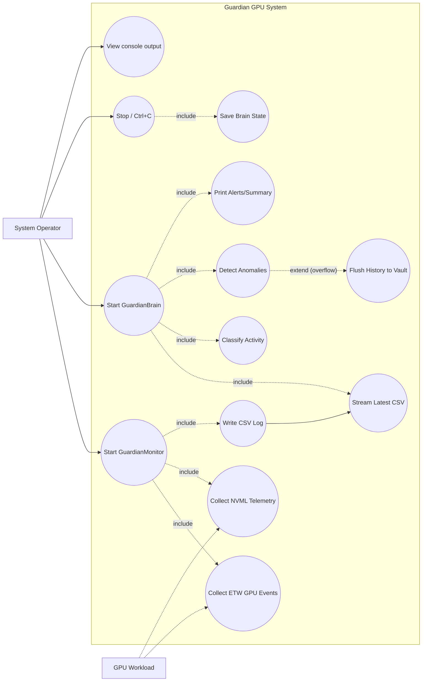
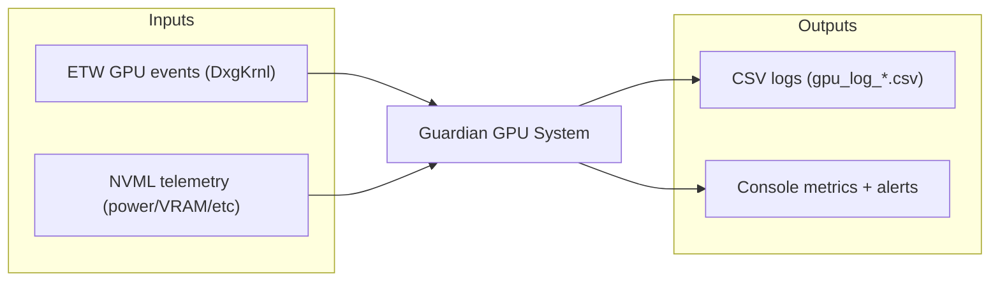
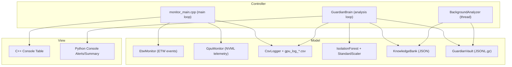
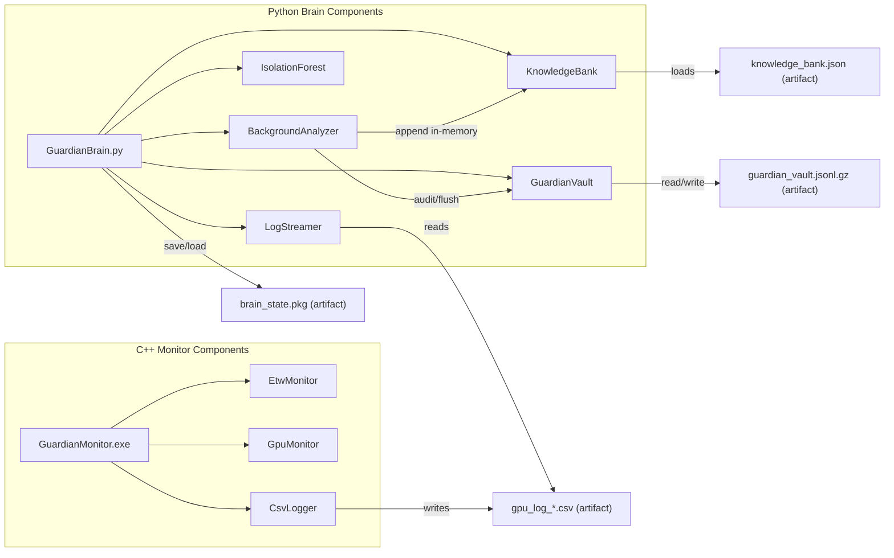
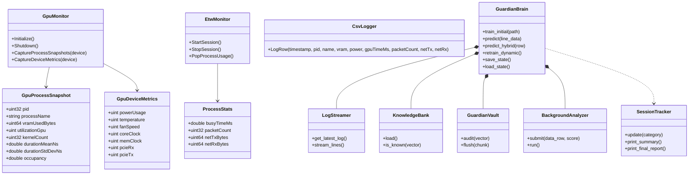
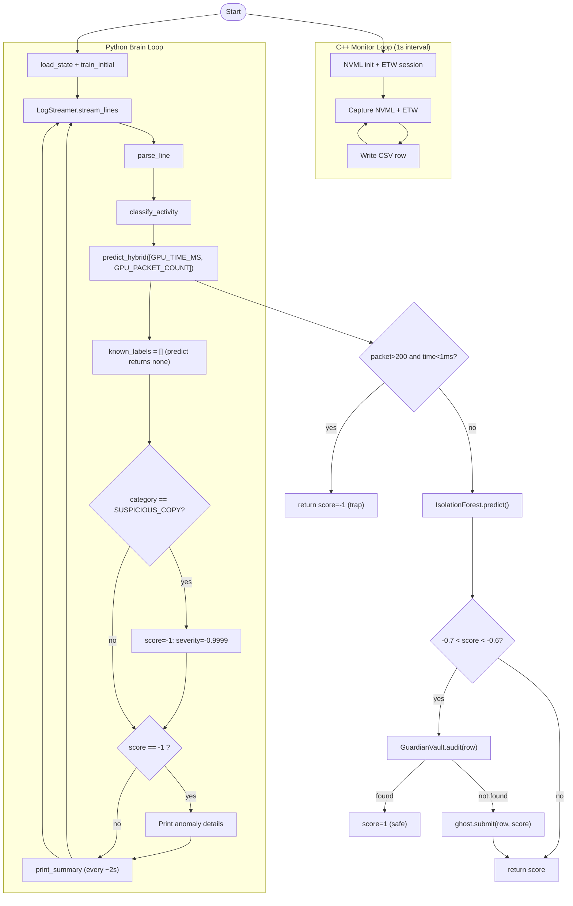
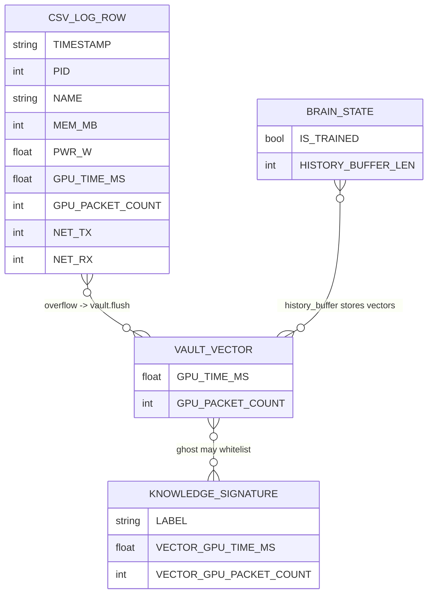

# Guardian GPU - Final Diagrams (Aligned to Code)
Date: 2026-02-06

Notes
- Aligned with: monitor_main.cpp, gpu_mon.h/cpp, etw_monitor.h/cpp, csv_logger.h, guardian_brain.py
- Focused on the active ETW + NVML + Python Brain pipeline
- Legacy CUPTI injection in legacy/ is not represented here

---

## Figure 1.1: System Overview (Detailed, Code-Aligned)

---

## Figure 3.1: Use Case Diagram (Aligned to Code)

---

## Figure 4.1: Blackbox (Inputs and Outputs)

---

## Figure 4.2: MVC Architecture (C++ Monitor + Python Brain)

---

## Figure 4.3: UML Component Diagram

---

## Figure 4.4: Class Diagram (Key Types)

---

## Figure 4.5: Operational Flow (Exact to Current Code)

---

## Figure 4.6: ERD (Full, Code-Aligned)

